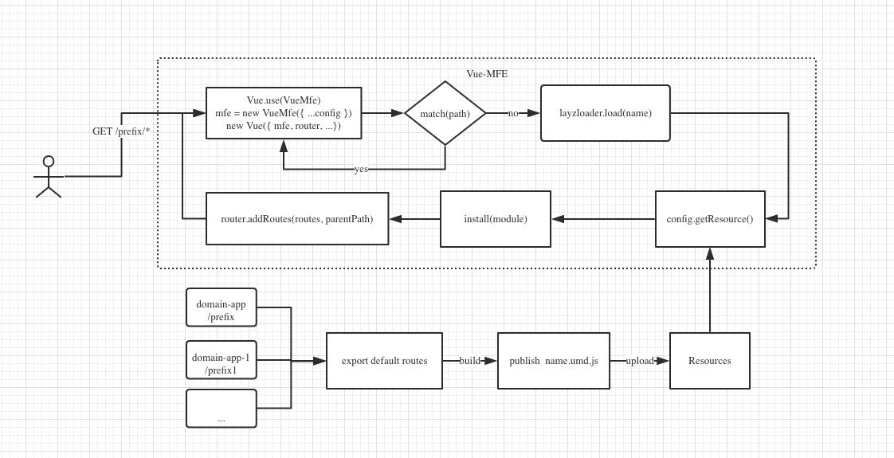

<p align="center"><a href="https://vuchan.github.io/vue-mfe" target="_blank" rel="noopener noreferrer"></a></p>

<p align="center">
  <a href="https://npmcharts.com/compare/vue-mfe?minimal=true"></a>
  <a href="https://www.npmjs.com/package/vue-mfe"></a>
  <a href="https://github.com/996icu/996.ICU/blob/master/LICENSE"></a>
  <br>
</p>


# VueMfe

✨ A JavaScript library for Vue.js micro front-end(App) solution.

```bash
___________
| | |__ |__
| | |   |__
```


## FEATURES
+ Support dynamically add child routes to an existing route & nested route.
+ Support preinstall or lazyload a sub-app & nested sub-app.
+ Support load a component remotely


## How?



## MASTER-RUNTIME
```js
import router from '@@/router/index'
import { createApp } from 'vue-mfe'

// 主运行时
/** @type {VueComponent & VueMfeApp} */
export default createApp(/** @type {VueRouter} */router, {
  // 是否对大小写敏感 '/AuTh/uSEr' => '/auth/user'
  /** @type {boolean} */
  sensitive: false,

  // 默认的 parentPath => router.addRoutes(routes, parentPath)
  /** @type {string} */
  parentPath: '/',

  // 获取资源的配置函数，支持同步和异步
  /** @type {Object|Function} */
  resources: () => {},
})
```


### SUB-APP
```js
import routes from '@@/router/index'
import { createSubApp } from 'vue-mfe'

export default createSubApp({
  /** @type {string}  */
  prefix: '/prefix',

  // module name
  /** @type {string}  */
  name: '工作流',

  // the parent path of current sub app
  parentPath: '/',

  // umd global variable
  /** @type {string}  */
  globalVar: '__domain__app__prefix',

  // main resources .css & .js
  /** @type {string[]}  */
  resources: ['main.xxxxxxx.css', 'prefix.xxxx.umd.js', 'prefix.xxxx.umd.js'],

  // dynamic routes will be auto injected to main app router
  /** @type {RouteConfig[]} */
  routes,

  /** @type {() => void|Promise<T>} init function */
  init: () => {},

  /** @type {Object<string, Function>} */
  components: {
    FlowLayout: () =>
      import('./views/flow/design-center/components/flow/index'),
  },
})
```

## LAZY-LOAD
```js
import VueMfe from 'vue-mfe'

// if use it without called method `VueMfe.createApp(config: AppConfig)`
VueMfe.setConfig({
  resources: {
    a: 'a.umd.js',
    b: 'b.umd.js'
  }
})

VueMfe.lazy('a.components.ComponentName')
```


## API

+ `VueMfe.lazy`
+ `VueMfe.createApp`
+ `VueMfe.createSubApp`


## TODO
+ [ ] unit test cases
+ [x] deploy docs by vuepress
+ [x] publish package to npm registry


## Troubleshooting

> This needs to be changed if multiple webpack runtimes (from different compilation) are used on the same webpage. Does anyone know how to resolve it?

  + [Multiple Webpack entry points loaded](https://github.com/webpack/webpack/issues/2112)
  + [Dynamic require breaks when using more than one webpack bundle at the same time] (https://github.com/webpack/webpack/issues/3791)
  + [在同一个页面中加载多个 webpack 实例](https://github.com/zh-rocco/fe-notes/issues/1)
  + [How can I combine two completely separate bundles using dynamic bundling?](https://stackoverflow.com/questions/42450048/webpack-how-can-i-combine-two-completely-separate-bundles-using-dynamic-bundlin)
  + [hosting-multiple-react-applications-on-the-same-document](https://medium.jonasbandi.net/hosting-multiple-react-applications-on-the-same-document-c887df1a1fcd)
