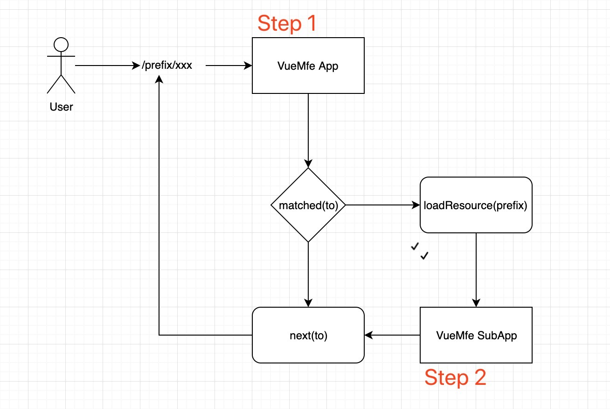

<p align="center"><a href="https://vuchan.github.io/vue-mfe" target="_blank" rel="noopener noreferrer"></a></p>

<p align="center">
  <a href="https://npmcharts.com/compare/vue-mfe?minimal=true"></a>
  <a href="https://www.npmjs.com/package/vue-mfe"></a>
  <a href="https://github.com/996icu/996.ICU/blob/master/LICENSE"></a>
  <br>
</p>


# VueMfe

✨😊 基于 Vue.js 设计的微前端解决方案. [English](./README-en_US.md) | [示例](https://vuchan.github.io/vue-mfe)

```bash
___________
| | |__ |__
| | |   |__
```


## FEATURES
+ 支持动态注入子路由、嵌套路由。
+ 支持通过动态路由懒加载应用、嵌套子应用。
+ 支持远程懒加载模块或者组件。
+ 支持子应用独立打包，独立构建，独立运行(需插件支持)。


## How

Vue-MFE 实现的微前端原理是基于基座(App)，当基座项目拦截到无匹配项的路由后会尝试动态加载子应用(SubApp)的路由。并在子应用路由被成功注入到基座的路由实例 `this.$router` 后 `next(to)` 从而实现完整闭环。

<p align="center">
  
</p>


## DEMO
```bash
npm install
npm run example
```


## USAGE

### Step 1

创建基座应用，因为这里需要注册 `router` 实例的 `beforeHook` 钩子，所以 `router` 为必填项。

```js
import router from '@@/router/index'
import { createApp } from 'vue-mfe'

// 主运行时
/** @type {VueComponent & VueMfeApp} */
export default createApp({
  /** @type {VueRouter} */
  router
})
```


### Step 2

创建子应用。可以创建任意多个子应用，前提是 prefix 不能重复。

```js
import routes from './router/routes.js'
import { createSubApp } from 'vue-mfe'

export default createSubApp({
  prefix: '/demo',
  routes,
  name: '示例',
  // 模拟从本地加载资源
  // resources 中的资源会被按顺序安装和执行
  resources: []
})
```


## API

+ `VueMfe.createApp({}: AppConfig)` 创建主(基座)应用 [source code](./src/index.js)

```js
/**
 * createApp
 * @typedef AppConfig
 * @property {Router} router 必选，主应用 VueRouter 根实例
 * @property {boolean} [sensitive] 可选，默认 false，是否对大小写敏感 '/AuTh/uSEr' => '/auth/user'
 * @property {string} [parentPath] 可选，默认 '/'，默认路由被嵌套的父路径
 * @property {Resources} [resources] 可选，获取资源的配置函数，支持同步/异步的函数/对象。resources 中返回的资源会按顺序安装和执行，且 SubAppConfig.resources > AppConfig.resources
 * @typedef {Object<string, {}>|Object<string, string[]>|Object<string, {}[]>} RawResource
 * @typedef {RawResource & AppConfig & SubAppConfig} Resource
 *
 * @callback ResourcesFn
 * @returns {Resource|Resource[]|Promise<Resource>}
 * @typedef {ResourcesFn|Resource|Resource[]} Resources
 *
 * @param {AppConfig} config
 *
 * 1. 初始化路由，记录 rootApp
 * 2. 添加钩子，拦截无匹配路由
 * 3. 懒加载无匹配路由的 resources
 */
export default createApp({
  router,
  sensitive: false,
  // 默认的 parentPath => router.addRoutes(routes, parentPath)
  parentPath: '/',
  // 获取资源的配置函数/对象，支持同步/异步
  /** @type {{[prop: string]: Resource|Resource[]}|() => (Resource|Resource[])} */
  resources: () => {},
})
```

+ `VueMfe.createSubApp({}: SubAppConfig)` 创建子应用 [source code](./src/index.js)

```js
/**
 * createSubApp
 * @typedef {Object} SubAppConfig
 * @property {string} prefix 必选，需要被拦截的子应用路由前缀
 * @property {Route[]} routes 必选，需要被动态注入的子应用路由数组
 * @property {string} [name] 可选，子应用的中文名称
 * @property {(app: Vue)=>boolean|Error|Promise<boolean|Error>} [init] 子应用初始化函数和方法
 * @property {string} [parentPath] 可选，子应用默认的父路径/布局
 * @property {Resources} [resources] 可选，子应用的 resources 配置项，获取资源的配置函数，支持同步/异步的函数/对象
 * @property {string} [globalVar] 可选，入口文件 app.umd.js 暴露出的全部变量名称
 * @property {Object<string, Function>} [components] 可选，暴露出的所有组件
 *
 * @param {SubAppConfig} config
 *
 * 1. 安装子应用调用 createSubApp 方法
 * 2. 调用 registerApp 刷新内部的维护的 configMap
 * 3. 执行 SubApp 的 init(app) => void|boolean 方法，初始化项目的前置依赖
 * 4. 初始化成功后返回 success 并安装子应用路由
 * 5. next(to) 到具体的子路由，END
 */
export default VueMfe.createSubApp({
  prefix: '/demo',
  routes,
  name: '示例应用',
  parentPath: '/',
  resources: ['main.xxxxxxx.css', 'demo.xxxx.umd.js', 'demo.xxxx.umd.js'],
  /** @type {() => void|Promise<T>} init function */
  init: () => {},
  // 可选，子应用暴露出的组件。后续可通过 `Vue.Lazy('prefix.components.componentName')` 访问到子应用所暴露的对应组件。
  /** @type {Object<string, Function|Object>} */
  components: {
    example: () =>
      import('./components/example'),
  },
})
```

+ `VueMfe.Lazy(path: string)` 懒加载模块或者组件 [source code](./src/core/lazy.js)

```js
/**
 * Lazy
 * @description 解析传入的名称获取应用前缀，懒加载应用并返回解析后的 module 内部变量
 * @tutorial
 *  1. 远程组件内部必须自包含样式
 *  2. 远程组件同样支持分片加载
 *  3. 可以引入所有被暴露的模块
 * @param {string} url appName+delimiter+[moduleName?]+componentName
 * @param {string} [delimiter] 分隔符
 * @example 引入特定 appName 应用下特定 moduleName 下特定 componentName
 *  ```js
 *    const LazyComponent = VueMfe.lazy('appName.moduleName.componentName')
 *  ```
 * @example 引入 workflow 下入口文件暴露出的 FlowLayout 组件，wf 为 appName，FlowLayout 为 portal.entry.js module 暴露出的变量
 *  ```js
 *    const FlowLayout = VueMfe.lazy('wf.components.FlowLayout')
 *  ```
 */
VueMfe.Lazy('demo.components.example')
```

## TODO
+ [ ] unit test cases
+ [x] deploy docs by vuepress & netlify
+ [x] publish package to npm registry


## Thanks

If it has any help or inspiration, please give me a star to light my days. And if you have any confusing problem just go to make an issue, i'll fix or answer it when i see that.
