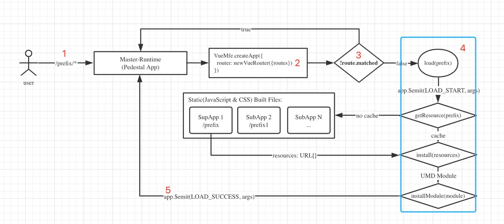

```bash
___________
| | |__ |__
| | |   |__
```

# vue-mfe

Vue-mfe, a micro front-end resolution based on Vue.js.



## CONCEPTS

## FEATURE
+ very simple with only one method `createMasterRouter`
+ dynamic route & dynamic nested route
+ each Micro App entry based on route prefix in `master-runtime`

## API


## Troubleshooting

> This needs to be changed if multiple webpack runtimes (from different compilation) are used on the same webpage.

+ 解决不同的 webpack runtime 引入多个不同 entry?
  + [Multiple Webpack entry points loaded](https://github.com/webpack/webpack/issues/2112)
  + [Dynamic require breaks when using more than one webpack bundle at the same time](https://github.com/webpack/webpack/issues/3791)
  + [3](https://github.com/zh-rocco/fe-notes/issues/1)
+ How can I combine two completely separate bundles using dynamic bundling?
  + [stack overflow](https://stackoverflow.com/questions/42450048/webpack-how-can-i-combine-two-completely-separate-bundles-using-dynamic-bundlin)
  + [medium](https://medium.jonasbandi.net/hosting-multiple-react-applications-on-the-same-document-c887df1a1fcd)
