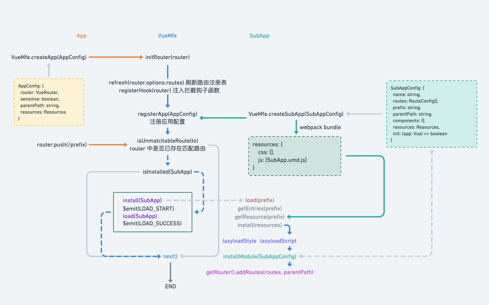

# Vue-MFE

✨ 基于[Vue.js](https://vuejs.org/)技术栈设计的微前端解决方案。

## What

- 通过**中心化路由器** `router: VueRouter` 的 `beforeHook` 探测子应用
- 提供**资源懒加载器** `loader`
- 提供**远程模块加载** `VueMfe.Lazy(SubApp.moduleName.propertyName: string)`

## Why

- 支持**动态注入**路由到中心化路由器 `router.addRoutes(routes: VueRoute[], parentPath: string)`
- 支持**懒加载子应用**
- 支持**嵌套子应用**
- 支持**懒加载组件**或**模块**
- 支持**独立开发**和**独立构建**(将入口文件构建成 UMD 格式即可)

## How

Vue-MFE 实现的微前端原理是基于基座(VueMfe App)。

1. 当用户初次访问路由`/prefix/*`
2. 使用`VueMfe.createApp(router)`注册 **微前端主应用`App`**(即基座自身)
3. 判断当前`app.$router`是否存在路由`prefix`
4. 动态装载 **微前端子应用`SubApp`** 的静态资源和路由
5. 跳转到用户访问的路由`prefix`实现完整闭环



## installation

### CDN

```html
<script src="https://cdn.jsdelivr.net/npm/vue/dist/vue.js"></script>
<script src="https://cdn.jsdelivr.net/npm/vue-router/dist/vue-router.js"></script>
<script src="https://cdn.jsdelivr.net/npm/vue-mfe/dist/vue-mfe.js"></script>
```

### CLI

#### yarn

```bash
yarn add vue-mfe -S
```

#### npm

```bash
npm install vue-mfe --save
```
